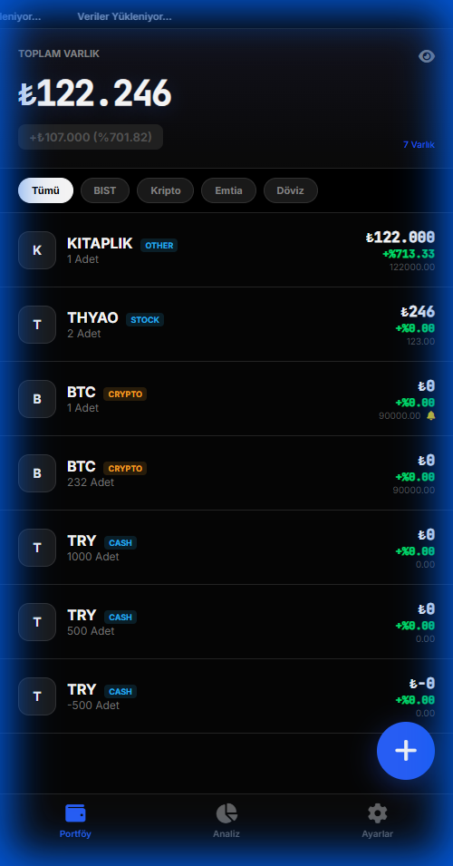

# Pro Portfolio Manager

  

> Modern, secure, and mobile-first personal portfolio tracking application.

<p align="center">
  
</p>

## 🚀 Live Demo

[**Open App**](https://batuhania.github.io/pro-portfolio-manager/)

## ⚡ Quick Setup

1. **Open the App:** Click the demo link above.
2. **Configure:** Go to **Settings** > Enter your API keys.

**One-Click Configuration:**
Use this URL format to auto-configure (URL is safe, keys stored locally):
```
https://batuhania.github.io/pro-portfolio-manager/?sburl=YOUR_URL&sbkey=YOUR_KEY
```

## 📱 Features

- **PWA Support:** Installable on iOS/Android as a native app.
- **Mobile Optimized:** Designed for touch, swipe gestures, and safe-area insets.
- **Real-time Data:** Fetches live asset prices via Supabase.
- **AI Analysis:** Integration with OpenAI for portfolio insights.
- **Privacy First:** No hardcoded keys. All data stored in `localStorage`.

## 🛠 Tech Stack

- **Frontend:** Vanilla HTML5, CSS3, JavaScript (ES6+)
- **Storage:** Supabase (Backend), LocalStorage (Client)
- **Charts:** Chart.js
- **Icons:** FontAwesome

## 🔒 Security Note

This repository is **100% clean** of secrets.
- No hardcoded API keys.
- No sensitive URLs in commit history.
- API keys are input by the user and stored only on their device.

---
© 2026 Batuhan. All rights reserved.
